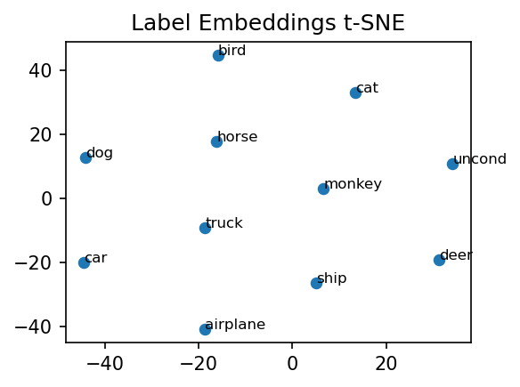
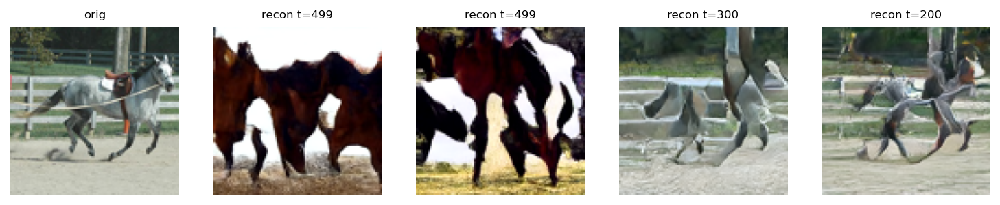
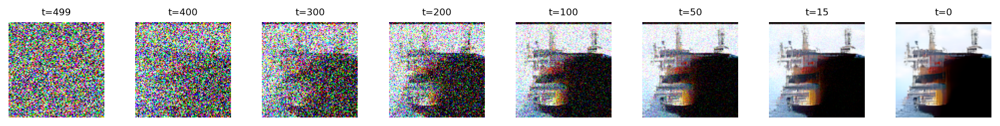
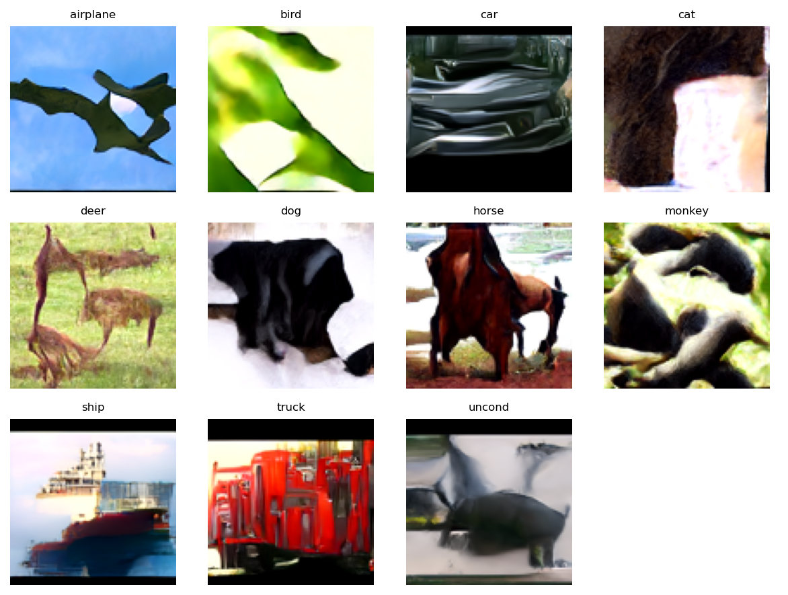

## STL10 Class-Conditional Diffusion (96×96)

A class-conditional diffusion model for STL10 at native 96×96 resolution. Built from my MNIST diffusion baseline with the following key upgrades:

- **3-channel support and deeper U-Net**: extended the network by one down/up stage for STL10 complexity.
- **Label embeddings + Classifier-Free Guidance (CFG)**: learned embeddings for 10 classes plus an unconditional token; CFG at sampling boosts class fidelity.
- **v-prediction objective**: predicts v instead of epsilon for improved stability.
- **Cosine noise schedule (500 steps)**: fewer, more effective steps vs 1000 linear; reduces late-step information squeeze.
- **Training stability**: EMA, AdamW, gradient clipping, and gradient accumulation (cumulative batch size).


### Dataset
- **STL10** (`torchvision.datasets.STL10`) at 96×96, normalized to [-1, 1].
- Class names: `['airplane','bird','car','cat','deer','dog','horse','monkey','ship','truck']` (+ `uncond`).


### Model highlights
- U-Net accepts `[B, 3, 96, 96]`, predicts v with CLIP text conditioning.
- Text conditioning via precomputed CLIP ViT-B/32 embeddings (10 classes + empty prompt for unconditional), injected through cross-attention; CFG training uses label drop probability to learn the unconditional branch.
- No FiLM used (classes are simple; CLIP embeddings + CFG sufficed).


### Training pipeline
- Core script: `main_stl10.py` (see constants at top for hyperparameters).
- Notable defaults in code:
  - `NUM_TIME_STEPS = 500`, cosine schedule
  - `BATCH_SIZE = 64`, `LR = 2e-5`, `DROPOUT = 0.1`
  - `EMA_DECAY = 0.999`, `CFG_P_UNCOND = 0.2`, `CFG_SCALE` used at sampling
  - AdamW with weight decay, gradient clipping, LR warmup + cosine decay

Run training (full set) from the project root:

```bash
python -c "from main_stl10 import train; train()"
```

Sanity overfit on a tiny subset (toggle in code):

```python
# in main_stl10.py
OVERFIT_TINY = True
OVERFIT_SIZE = 512
```

Checkpoints save periodically as `stl10_checkpoint_epoch_*.pt` (also under `artifacts/models/` in this repo).


### Evaluation and metrics
During/after training, the code writes visual diagnostics to `intermiate imagees/epoch_{E}/` and logs to TensorBoard (`runs/stl10`). The five key “metrics”/visual checks:

- **t-SNE of label embeddings**: reduces learned label embeddings to 2D. Results looked semantically sound: most animals clustered together; car and truck nearby.
- **Denoising collage from pure noise**: snapshots across timesteps to inspect the formation of structure.
- **Pure generation (fixed seeds)**: class-conditional grid (classes 0–9 + unconditional) to assess diversity and class fidelity.
- **Single-sample reconstruction at different t**: forward diffuse an image to t, then reverse to test reconstruction quality.
- **Reconstruction sweep**: orig + reconstructions at multiple t values in one panel.

Reproduce the full monitoring set for a checkpoint:

```bash
python -c "from main_stl10 import inference_full; inference_full('stl10_checkpoint_epoch_800.pt')"
```


### Inference sweeps (CFG and eta)
I grid-searched inference parameters: scheduler type, `eta` (DDIM/DPMS-like), and `CFG` scale. Empirically:

- **Cosine scheduler** at 500 steps worked best.
- **DDIM (`eta=0.0`) underperformed** for this setup; stochastic sampling (`eta=1.0`) gave more coherent results.
- **Best CFG ≈ 6.0**: higher scales added detail (e.g., car lights) but overconfidently collapsed and hurt other classes.

Run the sweep utility to regenerate grids under `docs/images/sweeps/`:

```bash
python inference_sweeps.py \
  --checkpoint artifacts/models/stl10_checkpoint_epoch_2000.pt \
  --schedulers cosine linear \
  --cfg 0.0 1.5 3.0 6.0 9.0 \
  --eta 0.0 1.0 \
  --labels 0 1 2 3 4 5 6 7 8 9 10 \
  --seed 42 \
  --out docs/images/sweeps
```

### Figures (final state)
- Embeddings t-SNE (epoch 2000):



- Reconstruction sweep (epoch 2000):



- Denoising collage from noise (epoch 2000):



- Class-conditional grid (CFG≈6, epoch 2000):




### Sweep comparisons (cosine scheduler)
- CFG=6.0 at eta=0.0 vs eta=1.0:


- eta=1.0 at CFG≈1, 3, 6, 9 (files available: 1.5, 3.0, 6.0, 9.0):


### Quick sampling
Single image from noise, optionally class-conditional:

```bash
python -c "from main_stl10 import inference; inference('stl10_checkpoint_epoch_800.pt', label=3, guidance_scale=6.0)"
```


### Findings
- Overfitting a small subset confirmed the model/implementation could learn; reconstructions became sharp quickly while pure-from-noise samples stayed weak early on (expected).
- Stability improved with EMA, AdamW, clipping, accumulation, cosine schedule, and switching from epsilon to v-prediction.
- Reducing steps from 1000→500 avoided late-step information squeeze and trained better.
- Final samples are not perfect and somewhat blurry, but show clear class distinctions.
- Extra training (~+2000 epochs) yielded limited gains; inference tuning (CFG≈6, stochastic sampling) mattered more.

### Why move to CLIP text conditioning (next step)
- Current setup uses randomly initialized label embeddings for 10 classes (+uncond). With only 5k labeled images in STL10, the network must learn class semantics from scratch while learning vision—an unnecessary burden that weakens class alignment and hurts pure-noise sampling.
- Using pre-trained CLIP text embeddings offloads semantic understanding to a language–vision model already trained on massive data. The U-Net can then focus on rendering pixels from a rich, fixed conditioning space.
- We will keep CFG by pairing class prompts (e.g., "a photo of a car") with an empty prompt for the unconditional branch. CLIP encoder stays frozen.


### CLIP text conditioning (implemented)
- Replaced learned label embeddings with precomputed text embeddings from CLIP ViT-B/32.
- Prompts: "a photo of a {class}" for the 10 STL10 classes; unconditional uses an empty string.
- Embeddings are computed once and frozen; they are looked up by class index (0–9) with index 10 reserved for unconditional.

Prepare embeddings:

```bash
python prepare_clip_embeddings.py
```

This writes `artifacts/clip/clip_text_emb_stl10_vitb32.{pt,npz}` and records `context_dim` (e.g., 512 for ViT-B/32). Training and inference load this tensor and pass the per-sample context to the U-Net.

Conditioning flow per U-Net layer:
- ResNet Block (spatial features): extracts structure from x and injects time embedding.
- Self-Attention (image-only): models long-range dependencies.
- Cross-Attention (image ↔ text): queries from image features, keys/values from CLIP text. Refinement on top of spatial features:

```python
final_out = res_out + cross_attn_out
```

This preserves core image structure while allowing text to guide salient regions.

### Paths and artifacts
- Checkpoints: project root and `artifacts/models/`
- Monitoring images: `intermiate imagees/epoch_{E}/`
- TensorBoard: `runs/stl10/` (includes label embedding projector TSVs)
- Example figures: see `docs/images/`


### Environment
- PyTorch, torchvision, timm (for EMA), scikit-learn (optional, for t-SNE), matplotlib.
- GPU recommended.

Install basics (example):

```bash
pip install torch torchvision timm scikit-learn matplotlib
```

Install CLIP:

```bash
pip install git+https://github.com/openai/CLIP.git
```


### Notes
- Images are 96×96 and 3-channel end-to-end.
- Label IDs 0–9 map to STL10 classes; 10 is the unconditional token used by CFG.
- FilM was not required here; embeddings + CFG were sufficient.
