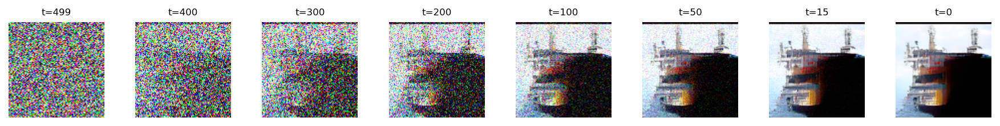
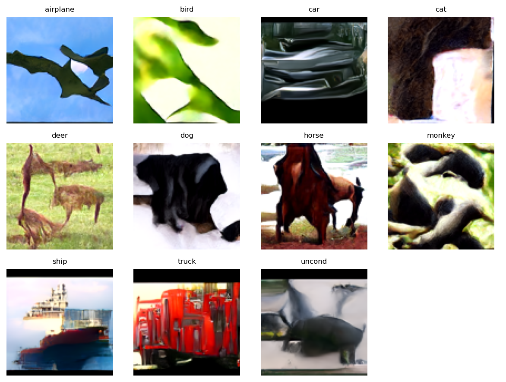
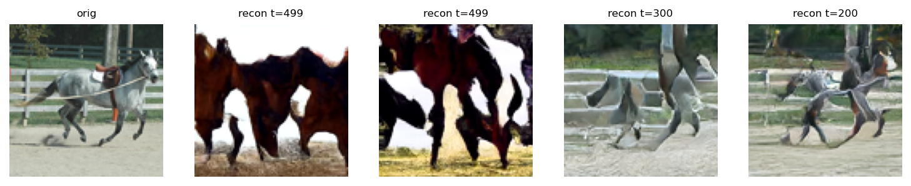
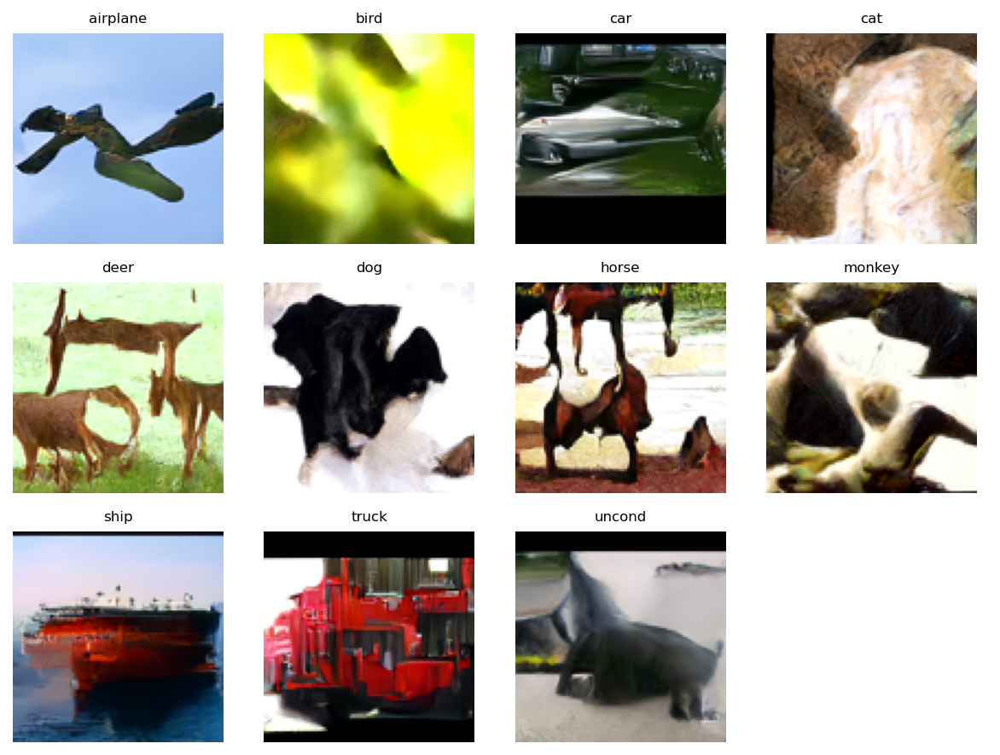

## Latest Training Run Summary

### Model architecture overview (UNET for 96×96 RGB)
- **Inputs/outputs**: 3→3 channels; image size 96×96
- **Time steps**: 500 (cosine schedule)
- **Embeddings**:
  - **time embedding**: 256-dim sinusoidal → 2-layer MLP
  - **label embedding**: 11×256 (classes 0–9 + 10=unconditional)
  - **conditioning path**: sum(time_emb, label_emb), injected into every ResBlock; **FiLM**: disabled
- **Blocks and attention**:

| Layer | Path | In→Out ch | Attention | Scale op |
| --- | --- | --- | --- | --- |
| L1 | down | 64→64 | no | downsample (stride-2 conv) |
| L2 | down | 64→128 | yes | downsample (stride-2 conv) |
| L3 | up | 128→256 | yes | upsample (nearest + conv, then 1×1 half-ch) |
| L4 | up | 256→128 | no | upsample (nearest + conv, then 1×1 half-ch) |

- **Norm/activations**: GroupNorm(num_groups=8), SiLU; dropout=0.1 in ResBlocks
- **Head**: concat skip connections → conv → conv → 1×1 output conv
- **Classifier-free training**: with probability 0.2, replace label with 10 (unconditional)
- **EMA**: decay 0.999; sampling uses EMA weights
- **Objective**: v‑prediction; sampling converts v→ε per-timestep

### What changed (new implementations)
- Switched objective to v-prediction (predict v; convert to ε at sampling).
- Added gradient accumulation via `VIRTUAL_BATCH_SIZE_MULTIPLIER` (virtual batch size): 2.
- Reduced diffusion steps from 1000 → 500 for a more stable/efficient schedule.
- Integrated TensorBoard live monitoring (loss, LR, fixed-seed grids, embeddings).
- Grouped all outputs by epoch under `intermiate imagees/epoch_{epoch}/`.

Note: VAE was not implemented in this run.

### Core hyperparameters (from `main_stl10.py`)
- NUM_EPOCHS: 1000
- BATCH_SIZE: 64
- VIRTUAL_BATCH_SIZE_MULTIPLIER: 2
- LR: 5e-5
- EMA_DECAY: 0.999
- NUM_TIME_STEPS: 500 (cosine noise schedule)
- DROPOUT: 0.1
- OVERFIT_TINY: False (OVERFIT_SIZE: 128)

### Optimizer & schedule
- Optimizer: AdamW (betas=(0.9, 0.99), weight_decay=1e-4)
- LR schedule: 5% warmup + cosine decay (stepped per optimizer update)
- Grad clipping: 1.0
- EMA: enabled; sampling uses EMA weights

### Objective & sampling
- Training objective: v-prediction
  - v_target = sqrt(alpha_bar) · ε − sqrt(1 − alpha_bar) · x
- Sampling: convert predicted v to ε per-timestep and use DDPM/DDIM update
- CFG (classifier-free guidance):
  - CFG_P_UNCOND: 0.2 (label drop probability during training)
  - CFG_SCALE (sampling): 3.0
  - SAMPLING_ETA: 1.0 (DDPM-like; set 0.0 for DDIM deterministic tests)

### Monitoring & logging
- TensorBoard (Scalars/Images/Projector):
  - Scalars: train/loss, train/lr every optimizer step
  - Images: fixed-seed class grid every 50 epochs
  - Embeddings: label embeddings added every 50 epochs
- Saved diagnostics per epoch bucket into `intermiate imagees/epoch_{epoch}/`:
  - Denoising collage
  - Fixed-seed class grid (0–9 + unconditional)
  - Reconstruction from x_t (default t=700)
  - Reconstruction sweep (e.g., t ∈ {700, 500, 300, 200})
  - t‑SNE of label embeddings

### Checkpointing
- Periodic: `stl10_checkpoint_epoch_{E}.pt` (every 200 epochs, plus extra at specified intervals)
- Additional full checkpoint written every 500 epochs as `stl10_checkpoint_epoch_{E}.pt`

### Rationale for key changes
- 500 diffusion steps: reduces compute and can be more stable; cosine schedule preserves late-step SNR.
- v-prediction: commonly improves stability and detail vs ε-prediction under cosine schedules.
- Virtual batch (accumulation): enables larger effective batch without extra VRAM; helps optimization smoothness.

### Observations informing decisions
- 🔍 4. Reconstruction vs. sampling gap
  - Reconstructions from x_t look reasonable, but sampling from pure noise fails.
  - Interpretation: forward diffusion matches data; reverse process diverges when starting at high noise.
  - Implication: the model may not see strong gradients at high‑noise timesteps; switching to v‑prediction and reducing total steps to 500 (with cosine schedule) is intended to improve gradients/SNR at early reverse steps and stabilize pure‑noise sampling.

#### Sample outputs (epoch 850)

| Collage | Fixed-seed grid | Reconstruction (t=499) | Label embeddings (t‑SNE) |
| --- | --- | --- | --- |
|  |  |  |  |

---

## Changelog (delta-only going forward)

Policy: log only changes to training/config/monitoring (no repeats). Append chronologically.

Template for each change entry:
- Date/Run: YYYY-MM-DD (run N)
- Changed:
  - Param: old → new (e.g., LR: 5e-5 → 1e-4)
  - Component: short note (e.g., enable mid-block attention)
- Removed/Disabled: (if any)
- Notes: brief rationale/observations

- Date/Run: 2025-09-05 (new run)
  - Changed:
    - Param: LR: 5e-5 → 2e-4
  - Removed/Disabled:
    - Resume from checkpoint: disabled (start from scratch)
  - Notes:
    - Restarting with higher LR to speed convergence; same 500-step cosine schedule, v-prediction, accumulation=2. Monitoring unchanged.

- Date/Run: 2025-09-06 (fixes + inference)
  - Changed:
    - Sampling alignment: fixed-seed grid now uses CFG_SCALE and SAMPLING_ETA (was CFG_MONITOR_SCALE and eta=0.0)
    - Reconstruction utilities: `reconstruct_from_dataset_sample` and `reconstruct_sweep` now use guidance_scale=CFG_SCALE (was 0.0)
  - Added:
    - `inference_full(checkpoint_path)`: loads EMA and reproduces collage, fixed-seed grid, reconstruction sample, sweep, and t‑SNE from a checkpoint
  - Notes:
    - This resolves the discrepancy between collage outputs and other monitoring images. Results from `inference_full` (e.g., epoch_600) look good and promising.

#### Sample outputs (epoch 2000)

| Collage | Fixed-seed grid | Reconstruction (t=499) | Reconstruction sweep | Label embeddings (t‑SNE) |
| --- | --- | --- | --- | --- |
|  |  |  |  |  |

- Date/Run: 2025-09-13 (resume 2000 → 4000)
  - Changed:
    - Training length: 2000 → 4000 epochs (resume)
    - LR schedule: reinitialized for 4000-epoch total; 5% warmup on new total
  - Notes:
    - Resuming from `stl10_checkpoint_epoch_2000.pt`. Scheduler fast-forwarded to current global step (accounts for accumulation). Last run was on a good track; extending training for further improvement. Add images from epochs ≥ 2000 here:
 
---

- Date/Run: 2025-09-15 (fine-tune from base epoch 3500)
  - Base model: `stl10_checkpoint_epoch_3500.pt`
  - Changed:
    - Optimizer: reinitialized AdamW (fresh state)
    - LR: 2e-5 (1/10 of prior 2e-4 peak)
    - Scheduler: new run-length, 5% warmup + cosine over 1500 epochs
    - Checkpoint names: `stl10_finetune_epoch_{E}.pt` every 200 epochs
    - Logs: `runs/stl10_finetune`
  - Notes:
    - Continuing training with smaller LR to refine details without destabilizing.
    - Do not load previous optimizer state to allow gentle adaptation.
    - Model/EMA weights loaded from base; architecture unchanged.

---

- Date/Run: 2025-09-16 (fine-tune diagnosis and action)
  - Summary: The model began to over-emphasize class-discriminative features (over-stylization) during fine-tuning.
  - Evidence (Good):
    - Horse: at 3500 it was abstract; now clearly recognizable (big improvement).
    - Car: learned headlights; more specific and symbolic than before.
    - Deer: more defined, less purely textural.
  - Evidence (Bad – Stylization):
    - Ship: extreme red hull and white superstructure.
    - Dog: exaggerated high-contrast black/white fur patterns.
    - High-t reconstructions: hyper-stylized; internal prior pushes toward high-contrast class archetypes.
  - Diagnosis: Over-optimization for the Classifier-Free Guidance signal. The model maximizes "not-unconditional" by driving class features to extremes.
  - Action taken:
    - Stopped fine-tuning early at ~850 epochs (instead of planned 1500).
    - Reduced CFG influence (lower CFG scale during sampling).
    - Performed inference at a lower resolution; results improved and were less over-stylized.
  - Next steps (guidance): consider tuning CFG per class, using lower CFG for sensitive classes, and preferring EMA weights for sampling.

### Visual comparison

#### High CFG (epoch 850)

| Collage | Fixed-seed grid | Reconstruction (t=499) | Reconstruction sweep | Label embeddings (t‑SNE) |
| --- | --- | --- | --- | --- |
|  |  |  |  |  |

#### Lower CFG (epoch 3200)

| Collage | Fixed-seed grid | Reconstruction (t=499) | Reconstruction sweep | Label embeddings (t‑SNE) |
| --- | --- | --- | --- | --- |
|  |  |  |  |  |

---

## Completion and artifacts (2025-09-16)

- Declared current version complete: further fine-tuning beyond ~200 epochs delivered diminishing returns; dataset size may be a limiting factor. For substantially more realism: consider latent diffusion, more data, or CLIP conditioning.
- Consolidated all images referenced in this log under `docs/images/` for publish-ready artifacts; intermediate image directories can be removed after verification.
- Saved model checkpoints for reference: `stl10_checkpoint_epoch_800.pt`, `stl10_checkpoint_epoch_2000.pt`, `stl10_checkpoint_epoch_3600.pt` under `artifacts/models/`.

---

## Next step: CLIP text conditioning (2025-09-21)

### Why change
- Current conditioning uses randomly initialized `nn.Embedding` for 10 classes (+uncond). On STL10’s small labeled set (5k images), the model must learn both:
  1) visual features of each class, and 2) the semantic meaning of each class token from scratch.
- This dual burden leads to weak semantic alignment, class confusion, and overconfident collapse at higher CFG. It also slows convergence and encourages blurry samples from pure noise.

### Solution
- Replace learned label embeddings with pre-trained text embeddings from CLIP. Map each class label to a short prompt (e.g., "a photo of a car"). Encode once with CLIP’s text encoder and freeze it.
- Use these CLIP embeddings as the conditioning vector per image. Keep classifier-free guidance by dropping to an empty prompt for the unconditional branch.

### Expected benefits
- Stronger semantic prior (language-informed) → better class separation and fidelity.
- Faster convergence; U-Net focuses on mapping rich semantics to pixels instead of inventing semantics.
- Improved diversity and stability at sampling time, especially at higher CFG.

### Plan (high level)
- Add CLIP tokenizer+text encoder (e.g., OpenAI CLIP ViT-B/32) with `torch.no_grad()` and `requires_grad_(False)`.
- Build a prompt table for STL10 classes; encode once at startup to a tensor `[11, D]` (10 classes + empty for uncond).
- Replace `model.label_embeddings` usage with a simple lookup into the precomputed CLIP embedding table.
- Maintain v-prediction objective, cosine 500-step schedule, EMA, and CFG logic as-is.

### Acceptance criteria
- At equal training budget, fixed-seed class grid shows crisper, more class-faithful samples at CFG≈6.
- Reduced collapse/overconfidence at high CFG (9) versus learned embeddings.
- Reconstruction quality remains as good or better; pure-noise sampling improves earlier in training.

---

## Update: Integrated CLIP text conditioning + U-Net cross-attention (2025-09-21)

- Changed:
  - Conditioning source: learned `nn.Embedding(11, D)` → precomputed CLIP ViT-B/32 text embeddings (11×D, classes 0–9 + uncond).
  - U-Net blocks: added per-layer cross-attention where queries come from image features and keys/values from the CLIP text context.
  - Guidance: unconditional branch uses an empty prompt; CFG training keeps `p_uncond` unchanged.
- Details:
  - Prompts: "a photo of a {class}"; unconditional: "".
  - Embeddings precomputed once via `prepare_clip_embeddings.py` and kept frozen; loaded at train/inference.
  - Layer flow: ResNet Block (spatial + time) → Self-Attention (image-only) → Cross-Attention (image ↔ text) with residual refinement:

```python
final_out = res_out + cross_attn_out
```

- Notes:
  - Rationale: keep strong spatial backbone while letting text refine salient regions, preventing the model from "forgetting" image structure when conditioning.
  - Expectation: better class fidelity at CFG≈6, earlier emergence of coherent shapes from pure-noise sampling.

## Update: Implemented VAE + switched to Latent Diffusion (2025-09-22)

- Added:
  - Variational Autoencoder: encoder/decoder implemented and integrated.
  - Dataset pre-encoding: all images encoded once to latents and saved at `docs/data/stl10_latents.pt`.
  - Latent diffusion training: U‑Net now operates in latent space (channels = VAE latent dim); noise and objective are applied on latents; sampling decodes latents back to RGB via the VAE decoder.
- Changed:
  - Data pipeline loads cached latents instead of raw images.
  - Retained v‑prediction objective, 500‑step cosine schedule, EMA, and CFG behavior.
- Observations:
  - Training is much faster end‑to‑end at the same effective batch size.
- Next:
  - Prefer adding more attention layers/heads at existing resolutions rather than deepening the network, since latent H×W are small.

---

## Incident: Class-conditional misalignment with VAE LDM (2025-09-23)

- Summary:
  - After enabling VAE/latent diffusion, sampling from pure noise produced plausible images but the requested class label often did not match. Reconstructions and titles looked correct (dataset labels), but unconditional/pure-noise generations drifted to a semantically “closest” class.
- Symptoms:
  - In fixed-seed class grids, several requested labels yielded images of another class. Reconstruction visuals annotated with dataset labels were correct, suggesting data/label pairing was fine.
  - CLIP text embeddings verified “PASS” (cos≈1 with recomputation) → not an embedding creation issue.
- Suspected root causes:
  - CLIP context table was loaded after model construction at some points, so U‑Net cross‑attention modules were not instantiated (conditioning effectively ignored).
  - Checkpoint resume may have mismatched cross‑attention parameter shapes, leaving those weights uninitialized or skipped on load.
  - Using the same constant random seed across classes in monitoring masked weak/absent conditioning, letting the sampler converge toward the nearest learned class in latent space.
- Impact:
  - Model learned to generate classes in general, but not conditionally; sampler tended toward the closest class manifold instead of the requested label.
- Fixes applied:
  - Ensure CLIP table loads before building the model in training and in full inference; U‑Net now receives `context_dim` only when `CONTEXT_TABLE` is present (enables cross‑attn).
  - Added runtime sanity print: number of active cross‑attention modules and CLIP table shape. Example seen: `[info] Cross-attention modules active: 4; CLIP table shape: (11, 512)`.
  - Relaxed checkpoint loads with clear warnings; initialize EMA fallback if missing to avoid partial state issues.
  - Added CLIP-based image scoring in fixed‑seed grid titles to display predicted class and similarity for each generated sample.
  - Added `verify_clip_embeddings.py` to validate stored CLIP text embeddings vs fresh encodes.
- Verification:
  - Console confirms cross‑attention active and table `(11, 512)`.
  - Embedding verification passed (self‑cosine ~1.0).
  - Grid titles show CLIP-predicted class aligning with requested label after fixes.
- Lessons / Next steps:
  - Always load external context (CLIP table) before model construction so modules depending on `context_dim` are instantiated.
  - When resuming, guard against shape/key mismatches; re‑init EMA if needed.
  - Keep CLIP self‑check in monitors to catch conditioning regressions early.

---

## Update: Widened U-Net base width (2025-09-23)

- Changed:
  - Base channels: 64 → 256; also tested 128.
- Rationale:
  - More filters enable richer feature recognition, allowing more image details to be captured.
- Observations:
  - Images are sharper and clearer with more fine details.
  - Still not good enough overall; further improvements are needed.